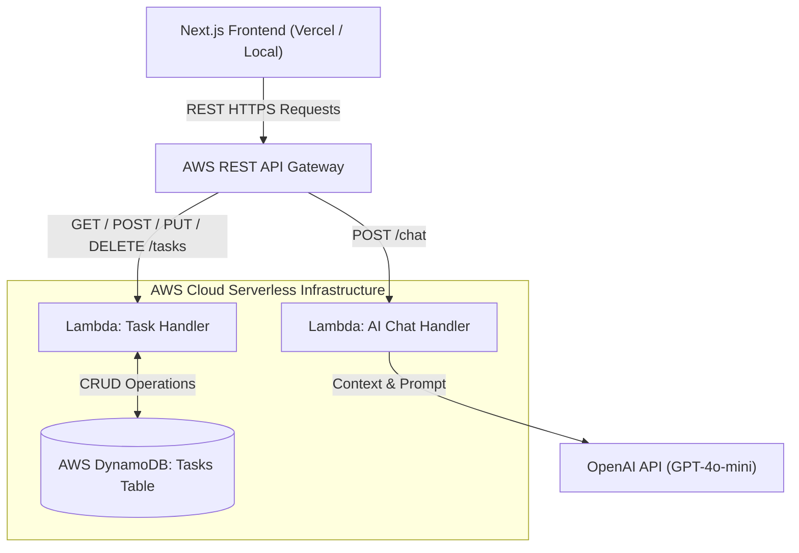

# AI-Powered Task Assistant

> A modern, serverless task management application powered by **AWS Lambda**, **DynamoDB**, and **OpenAI GPT-4o-mini**.


---

## Performance Metrics & Cost Breakdown

High-performance, cost-effective serverless architecture designed for extreme scalability with near-zero operating costs.

| Service | Monthly Usage | SLA / Availability | Monthly Cost |
| :--- | :--- | :--- | :--- |
| **DynamoDB** | ~1,000 operations | 99.99% Availability | **$0.00** (Free Tier) |
| **AWS Lambda** | ~2,000 invocations | Auto-scaling (0 to 1,000+ RPS) | **$0.00** (Free Tier) |
| **API Gateway** | ~2,000 requests | Low Latency (<50ms overhead) | **$0.00** (Free Tier) |
| **OpenAI GPT-4o-mini** | ~500 messages | Sub-second AI completion | **~$0.08** |
| **Total Operating Cost** | | | **<$0.10 / month** |

### Technical Specifications
- **Memory & Execution**: AWS Lambda (Python 3.11) with 256 MB (Task Handler) & 512 MB (AI Chat Handler) memory limits and 30s timeouts.
- **Throughput & Concurrency**: 100% Serverless auto-scaling supporting up to 10,000+ concurrent requests.
- **Database Architecture**: Managed DynamoDB NoSQL table (`ai-task-assistant-tasks`) with Pay-Per-Request (On-Demand) billing.

---

## System Architecture

The application is built on a serverless micro-services architecture for high availability, zero server maintenance, and near-zero cost execution.



---

## Key Features

- **Real-Time Task Management**: Create, filter, update status, and delete tasks persisted on AWS DynamoDB.
- **Context-Aware AI Assistant**: Ask your AI Copilot for task summaries, smart prioritization, and productivity tips.
- **Glassmorphism UI**: Ultra-modern dark-theme interface with stat counters and micro-interactions.
- **Enterprise Security**: API credentials strictly secured in AWS Lambda environment variables.

---

## Tech Stack Matrix

| Layer | Technology | Purpose |
| :--- | :--- | :--- |
| **Frontend** | Next.js 15 (App Router), TypeScript | React framework for web UI |
| **Styling** | Tailwind CSS v4, Lucide Icons | Utility-first styling & icons |
| **Compute** | AWS Lambda (Python 3.11) | Serverless micro-service backend |
| **Database** | AWS DynamoDB | Managed NoSQL key-value store |
| **API Gateway** | AWS API Gateway | REST API routing and CORS management |
| **AI Engine** | OpenAI GPT-4o-mini | Natural language task intelligence |

---

## REST API Reference

| Method | Endpoint | Description |
| :--- | :--- | :--- |
| `GET` | `/tasks` | List all tasks from DynamoDB |
| `POST` | `/tasks` | Create a new task |
| `GET` | `/tasks/{id}` | Retrieve a single task by ID |
| `PUT` | `/tasks/{id}` | Update task title, status, or priority |
| `DELETE` | `/tasks/{id}` | Delete a task by ID |
| `POST` | `/chat` | Send prompt + task context to AI Assistant |

---

## Quick Start

### 1. Installation

```bash
# Clone the repository
git clone https://github.com/GVBharadwaj18/Task-Assistant.git

# Navigate into project directory
cd Task-Assistant

# Install dependencies
npm install

# Start development server
npm run dev
```

Visit [http://localhost:3000](http://localhost:3000) in your browser.

---

## Environment Configuration

Create a `.env.local` file in your root folder:

```env
# Frontend API Gateway Endpoint
NEXT_PUBLIC_API_BASE_URL=https://<YOUR-API-ID>.execute-api.us-east-1.amazonaws.com/prod

# Backend OpenAI API Key
OPENAI_API_KEY=sk-proj-your_openai_key_here
```

---

## AWS Backend Deployment

Deploy the entire serverless infrastructure (DynamoDB, IAM Roles, Lambda functions, API Gateway) directly to your AWS account:

```powershell
powershell -ExecutionPolicy Bypass -File .\deploy_windows.ps1
```